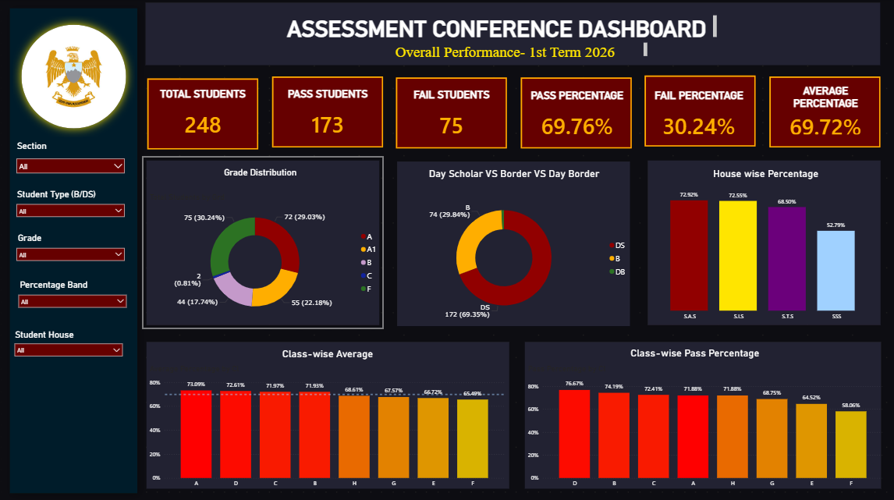
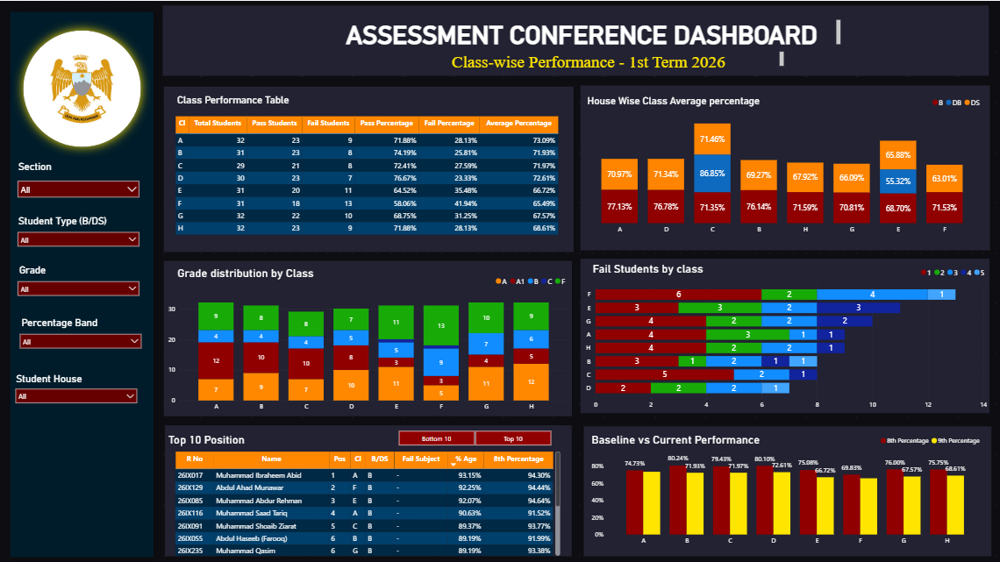
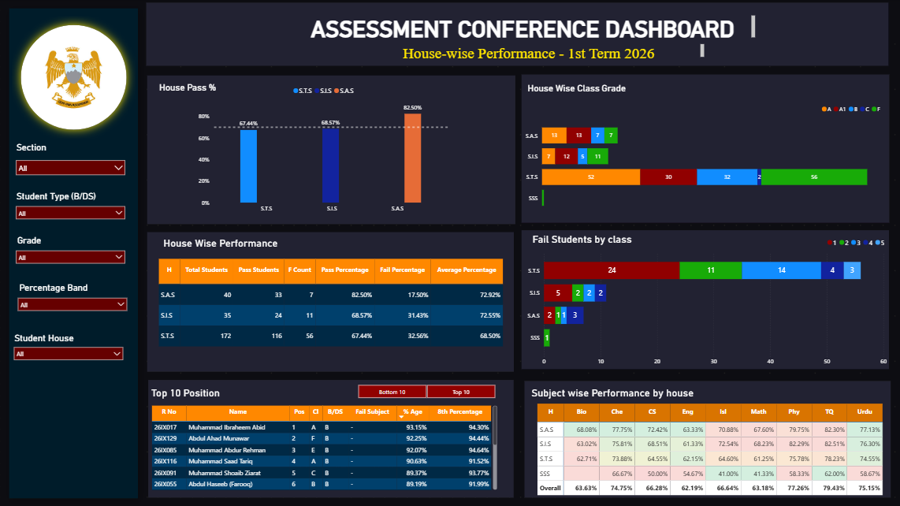
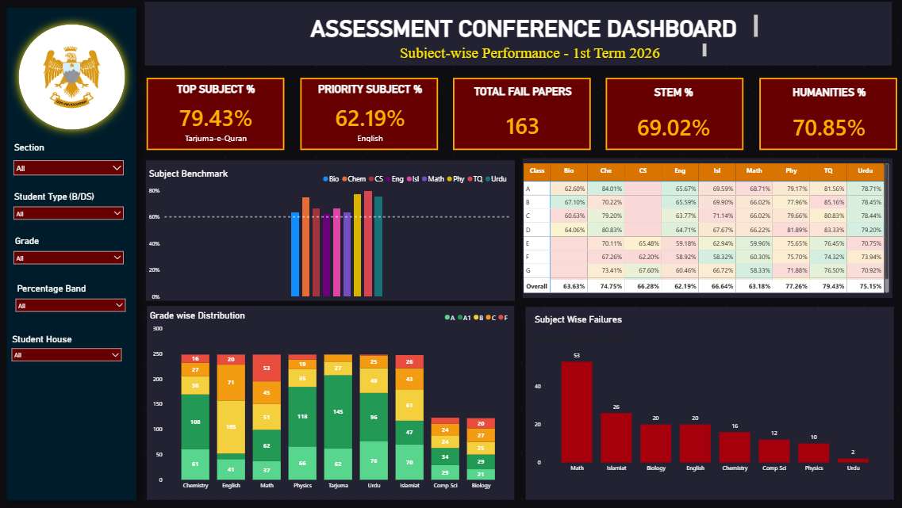
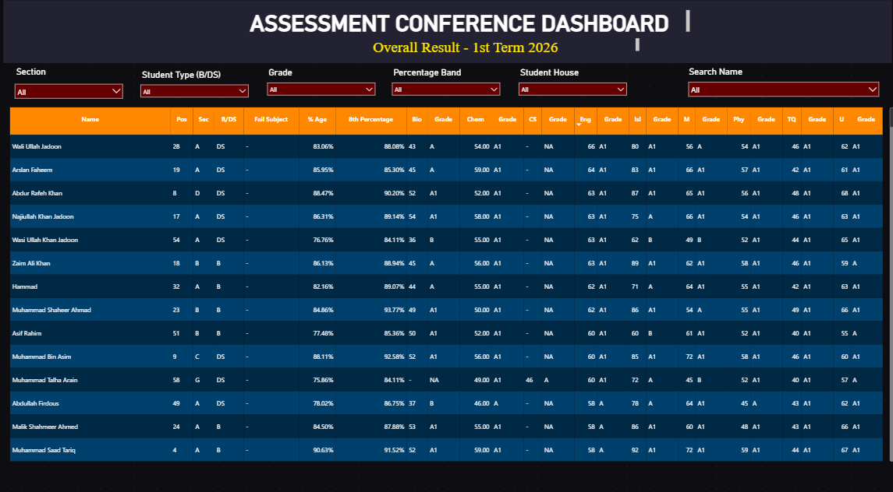

# 📊 Assessment Conference Dashboard — Power BI


---

## 📌 Overview

A comprehensive Power BI solution built to support academic review and assessment conference meetings. The dashboard transforms raw student examination records into actionable insights — helping administrators and academic coordinators evaluate performance, identify weak areas, and make data-driven decisions.

Built using **First Term Assessment (2026)** data for **248 Grade 9 students**, covering 9 subjects across 8 sections, 3 boarding houses, and Boarder/Day Scholar categories.

---

## 🖼️ Dashboard Preview

### 1. Overall Performance


### 2. Class-wise Performance


### 3. House-wise Performance


### 4. Subject-wise Performance


### 5. Student Search & Result Lookup


---

## 🎯 Objectives

- Monitor overall and class-wise student performance
- Diagnose subject-level strengths and weaknesses
- Identify students requiring academic intervention
- Compare Boarder vs Day Scholar performance
- Track grade distribution across the batch
- Support assessment conference discussions with interactive visuals
- Enable instant student-level result lookup

---

## 📂 Dataset

First Term Assessment records for **248 students** across **8 sections (A–H)**.

| Field | Description |
|---|---|
| Cl / Sec | Class / Section |
| R No | Roll Number |
| H | House (SAS, SIS, STS) |
| B/DS | Boarder / Day Scholar |
| Sta | Status (Present/Absent) |
| T Mks / O Mks | Total / Obtained Marks |
| % Age | Percentage |
| Grd | Grade (A1, A, B, C, F) |
| Pos | Position |
| F Sub | Failed Subjects Count |
| Subject Columns | Biology, Chemistry, Computer Science, English, Islamiat, Mathematics, Physics, Tarjuma-e-Quran, Urdu |
| 8th Percentage | Previous academic baseline |

---

## 🧹 Data Cleaning & Transformation (Power Query)

- Removed duplicate student records
- Standardized class and house naming conventions
- Verified roll number consistency
- Handled absent student records separately from fail records
- Converted percentage and mark columns to correct numeric types
- Standardized Boarder / Day Scholar labels
- Validated obtained marks against subject maximum marks
- Created **Grade Category**, **Pass/Fail Status**, and **Percentage Band** columns
- Trimmed whitespace and corrected inconsistent text entries

---

## 📐 Data Model

Star-schema-inspired structure built around a central **Results** fact table.

**Supporting Tables:**
- **Grade Table** — A1, A, B, C, F, Absent
- **Percentage Band Table** — 80–100%, 70–79%, 60–69%, 50–59%, Below 50%
- **Subject Table** — all 9 subjects for subject-level diagnostics

---

## 📊 Key DAX Measures

```DAX
Total Students = COUNTROWS(Results)

Appeared Students =
CALCULATE(COUNTROWS(Results), Results[Status]="Present")

Pass Students =
CALCULATE(COUNTROWS(Results), Results[F Sub]=0)

Fail Students =
CALCULATE(COUNTROWS(Results), Results[F Sub]>0)

Pass % = DIVIDE([Pass Students],[Total Students],0)*100

Average Percentage = AVERAGE(Results[% Age])

Math Average = AVERAGE(Results[M 75])
```

Additional measure groups built for: Grade counts (A1/A/B/C/F/Absent), per-subject average/pass%/fail%/highest/lowest, and failure severity (1 subject, 2 subjects, 3+ subjects failed).

---

## 📈 Dashboard Pages

| Page | Focus |
|---|---|
| **Overall Performance** | Total/Pass/Fail students, grade distribution, Boarder vs Day Scholar split, house-wise % |
| **Class-wise Performance** | Pass rate by class, grade distribution by class, fail students by class, baseline (8th%) vs current performance |
| **House-wise Performance** | House pass %, house-wise grade split, subject performance by house |
| **Subject-wise Performance** | Subject benchmark chart, grade-wise distribution per subject, subject-wise failure counts |
| **Student Search** | Searchable, filterable individual result lookup with full subject-wise grades |

All pages share a unified filter panel: **Section, Student Type (B/DS), Grade, Percentage Band, Student House.**

---

## 🔑 Key Findings

**Overall Batch**
- 248 total students · 173 passed · 75 failed → **69.76% pass rate**
- Average percentage: **69.72%**
- Highest scorer: **93.15%**

**Section Performance**
- Section D recorded the highest pass rate (76.67%)
- Section F showed the largest academic gap (58.06% pass rate)

**House Performance**
- **SAS House** — highest pass % (82.50%) despite smaller size (40 students)
- **STS House** — largest population (172 students), pass % 67.44%

**Subject Performance**
- **Tarjuma-e-Quran** — highest average performance (79.43%)
- **Mathematics** — highest number of failures (53 students)
- English showed the second-highest failure count (26 students)

**Demographics**
- Day Scholars: ~69% of cohort · Boarders: ~30%

> 📄 For the complete breakdown — including detailed methodology, full subject diagnostics, failure severity analysis, and additional insights — see the full presentation: [`report/assessment.pptx`](./report/assessment.pptx)

---

## 💡 Business Value

This dashboard enables academic leadership to:
- Monitor institutional and section-wise performance at a glance
- Pinpoint struggling classes, houses, and subjects instantly
- Prioritize intervention for at-risk students (multi-subject failures)
- Support data-backed discussions during assessment conferences
- Compare current performance against 8th-grade baseline to track trends
- Look up any individual student's full result in seconds

---

## ⚙️ Tools & Technologies

| Tool | Purpose |
|---|---|
| Microsoft Power BI Desktop | Dashboard design, data modeling, DAX |
| Power Query Editor | Data cleaning and transformation |
| DAX | KPI measures and calculated columns |
| Microsoft Excel | Source data format |

---

## 📂 Repository Structure

```
assessment-conference-dashboard/
│
├── powerbi/
│   └── assessment_conference_dashboard.pbix
│
├── report/
│   └── assessment.pptx
│
├── screenshots/
│   ├── 01_overall_performance.png
│   ├── 02_classwise_performance.png
│   ├── 03_housewise_performance.png
│   ├── 04_subjectwise_performance.png
│   └── 05_student_search.png
│
└── README.md
```

---

## 📂 Files & Reports

| File | Description |
|---|---|
| [`powerbi/assessment_conference_dashboard.pbix`](./powerbi/assessment_conference_dashboard.pbix) | Power BI dashboard — open in Power BI Desktop |
| [`report/assessment.pptx`](./report/assessment.pptx) | Full presentation — detailed methodology, diagnostics & insights |

---

## 👨‍💻 Author

**Bhadur Ali** — Data Analyst & Junior Data Scientist

MS Data Science · PAF-IAST

[](https://linkedin.com/in/bhadur-ali)
[](mailto:alikhansalar5@gmail.com)
[](https://github.com/BhadurAli)
